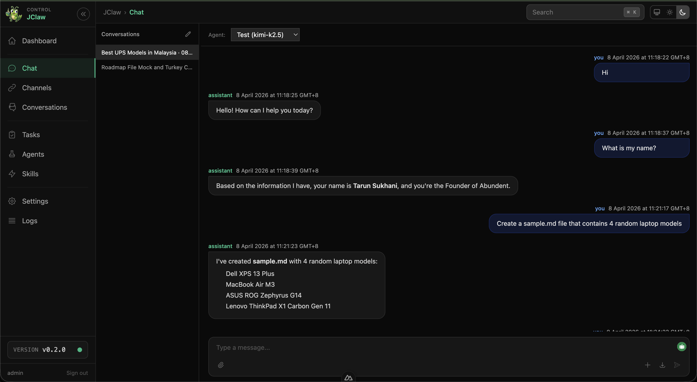

<h1 align="center">JClaw - Java-based Enterprise AI Assistant</h1>

<p align="center">
  
</p>

<p align="center">
  <strong>JAVA FIRST. NO BLOAT. PURE POWER.</strong>
</p>

<p align="center">
  <a href="https://jenkins.abundent.com/job/JClaw/"></a>
  
  
  
</p>

<br>

## Overview

JClaw is Abundent's AI-powered automation platform — built from scratch in **pure Java** on a customized [Play Framework 1.x](https://github.com/tsukhani/play1) foundation. It draws ideas and feature designs from two predecessor projects:

- **[OpenClaw](https://github.com/tsukhani/openclaw)** (Node.js/TypeScript) — agent orchestration, memory system, conversational AI patterns
- **[JavaClaw](https://github.com/jobrunr/javaclaw)** (Spring Boot) — job scheduling, background task processing, browser automation

The implementation is entirely original — no code is shared with either project. JClaw is built on Java library primitives (JDK HttpClient, ProcessBuilder, virtual threads, JPA) with no Spring, no heavy framework bloat, and no Node.js runtime on the server. The result is a leaner, faster, more maintainable platform for building AI agents and automation workflows.

---

## Screenshot

<p align="center">
  
</p>
<p align="center"><em>Web chat with memory-aware agents, tool execution, and markdown rendering.</em></p>

---

## Features

- 🤖 **Agent System** — Conversational AI agents with memory and context
- ⚡ **Job Scheduling** — Background tasks, cron jobs, and distributed execution
- 🔧 **Pure Java** — No Python/JavaScript runtimes required
- 📦 **Built-in Frontend** — Nuxt 3 SPA (Vue 3 + TypeScript)
- 🔌 **Plugin Architecture** — Modular, extensible design
- 🧠 **Memory & Context** — Persistent conversations across sessions
- 🚀 **Lightweight** — Minimal resource footprint, fast startup

---

## Directory Structure

```
jclaw/
├── app/                          # Application code
│   ├── controllers/              # HTTP controllers (Play 1.x pattern)
│   ├── models/                   # Domain models, entities
│   ├── services/                 # Business logic, services
│   ├── agents/                   # AI agent implementations
│   ├── jobs/                     # Background job handlers
│   ├── skills/                   # Modular skills/plugins
│   └── utils/                    # Utility classes
├── conf/                         # Play configuration
│   ├── application.conf          # Main app config
│   ├── routes                    # URL routing
│   ├── dependencies.yml          # Module dependencies
│   └── initial-data.yml          # Bootstrap data
├── frontend/                     # Nuxt 3 SPA (SPA-only; ssr: false)
│   ├── app.vue                   # Root component
│   ├── layouts/                  # Page layouts
│   ├── pages/                    # Nuxt file-based routes
│   ├── components/               # Reusable Vue components
│   ├── composables/              # Shared reactive state (useAuth, useEventBus, ...)
│   ├── middleware/               # Global route middleware (auth guard)
│   ├── public/                   # Static assets
│   └── nuxt.config.ts            # Nuxt configuration
├── lib/                          # Custom JARs (if needed)
├── modules/                      # Play modules (auto-managed)
├── public/                       # Static web assets
├── test/                         # Unit and integration tests
├── tmp/                          # Play temp/runtime files
├── logs/                         # Application logs
├── .github/                      # GitHub workflows (if migrated)
└── README.md                     # This file
```

---

## Getting Started

### Prerequisites

- JDK 25+ (Zulu recommended)
- Python 3.9+ (3.12 recommended) — Play's CLI commands are Python scripts
- [Abundent's Play Framework 1.x](https://github.com/tsukhani/play1) (`play` command in PATH)
- Node.js 20+ (24 recommended) for frontend
- pnpm for frontend package management

#### Optional system dependencies

**Tesseract OCR** — required for text extraction from images, scanned PDFs,
and image-only PDFs via the `documents` tool. Apache Tika invokes the
`tesseract` binary as a subprocess; without it, image inputs return empty
text. A startup probe logs a WARN line at boot if tesseract is missing so
the missing capability is visible without trial and error.

```bash
# Debian / Ubuntu
sudo apt-get install tesseract-ocr

# macOS
brew install tesseract

# Windows
choco install tesseract
# or: winget install --id UB-Mannheim.TesseractOCR
```

Additional language packs install separately. The default is English
(`eng`); install `tesseract-ocr-fra`, `tesseract-ocr-jpn`, etc. for other
languages, then update `ocr.tesseract.languages` in `conf/application.conf`
(e.g. `eng+fra+jpn`).

### Clone

```bash
git clone https://bitbucket.abundent.com/scm/jclaw/jclaw.git
cd jclaw
```

Dependencies are automatically installed when you start with `jclaw.sh`.

### Dev Container (Recommended)

The fastest way to start coding without installing any of the [Prerequisites](#prerequisites) on your host machine is to use the included dev container. The `.devcontainer/Dockerfile` ships a pinned toolchain (Java 25, Python 3.14, Node 24, corepack, the Play fork at the version recorded in `.play-version`, tesseract-ocr) on top of Ubuntu 26.04 LTS — all the prerequisites listed above, already installed.

#### Host prerequisites

Just two things on your machine:

1. **Docker Desktop** (macOS/Windows) or **Docker Engine** (Linux) — the dev container runs in a Docker container, so the Docker daemon needs to be running.
2. **An IDE that supports the [Dev Containers spec](https://containers.dev/)** — any of:
   - [Cursor](https://cursor.com/) (built-in support)
   - [VS Code](https://code.visualstudio.com/) with the **Dev Containers** extension
   - [JetBrains Gateway](https://www.jetbrains.com/remote-development/gateway/) with the Dev Containers plugin
   - [GitHub Codespaces](https://github.com/features/codespaces) (cloud, no local Docker needed)

#### First-time launch

After cloning, open the project in your IDE and trigger the "Reopen in Container" command:

| IDE | How to launch |
|---|---|
| **Cursor** | <kbd>Cmd</kbd>/<kbd>Ctrl</kbd>+<kbd>Shift</kbd>+<kbd>P</kbd> → `Dev Containers: Reopen in Container` |
| **VS Code** | Click the blue corner icon (bottom-left) → `Reopen in Container`, or <kbd>Cmd</kbd>/<kbd>Ctrl</kbd>+<kbd>Shift</kbd>+<kbd>P</kbd> → same command |
| **GitHub Codespaces** | Push your branch to GitHub → click `Code` → `Codespaces` tab → `Create codespace on main` |
| **JetBrains Gateway** | New Connection → Dev Containers → point at the local `jclaw` folder |

What happens automatically once you click:

1. Docker builds the image from `.devcontainer/Dockerfile` (~5–10 min the first time, cached on subsequent rebuilds).
2. Your local jclaw directory is bind-mounted into the container at `/workspaces/jclaw`. **Edits you make inside the container persist on your host** — the container is an environment, not a copy.
3. The IDE runs `postCreateCommand: ./jclaw.sh setup` automatically, which:
   - Validates all prerequisites (every check passes — they're baked into the image)
   - Wires git hooks (`.githooks/pre-commit`, `.githooks/pre-push`)
   - Validates the pinned pnpm version via corepack with integrity-hash verification
   - Runs `pnpm install` for the frontend
   - Adds the canonical `github` remote (`https://github.com/tsukhani/jclaw.git`)
4. Recommended VS Code/Cursor extensions install (Volar, Java Pack, ESLint, Stylelint, YAML).
5. The IDE attaches to the container — your terminal, file explorer, and editor are now running inside it.

#### Day-to-day inside the container

Everything works the same as it would on a native host. The container *is* a Linux dev box with the pre-installed toolchain:

```bash
./jclaw.sh --dev start    # dev mode (Play autoreload + Nuxt HMR)
./jclaw.sh test           # backend + frontend test suites
./jclaw.sh status         # check what's running
./jclaw.sh stop
```

Ports `9000` (backend) and `3000` (Nuxt) are forwarded to your host automatically. Open `http://localhost:9000` and `http://localhost:3000` in your **host's browser** while the dev server runs inside the container. The Nuxt port is configured to auto-open the browser when it boots; the backend port emits a notification.

#### Commits and `/deploy`

The pre-commit hook (frontend lint-staged) and pre-push hook (full test suite) work inside the container without any extra setup. Two nuances:

- **Signed commits** — `/deploy` produces signed commits and signed tags (`commit -S`, `tag -s`). Your host's GPG/SSH keys aren't visible inside the container by default. Two recovery options:
  1. **Easiest**: do `/deploy` from your host shell (open a host terminal, `cd` into the project, run the slash command). Code inside the container, deploy from outside.
  2. **More setup**: add a `mounts` block to `.devcontainer/devcontainer.json` to bind-mount `~/.ssh` and `~/.gnupg` into the container. Same end result, more configuration.
- **File ownership** — files written inside the container land on your host with UID 1000 (`ubuntu` user). On macOS this maps to your user automatically; on Linux you may see "owned by 1000" in `ls -l` if your host UID differs. Usually harmless.

#### Rebuilding

When the toolchain changes (e.g., a new Play version, a JDK bump, a base-image bump), you'll want a fresh build:

| IDE | How to rebuild |
|---|---|
| **Cursor / VS Code** | <kbd>Cmd</kbd>/<kbd>Ctrl</kbd>+<kbd>Shift</kbd>+<kbd>P</kbd> → `Dev Containers: Rebuild Container` |
| **JetBrains Gateway** | Container settings → `Rebuild` |
| **CLI fallback** | `docker build -t jclaw-devcontainer:latest .devcontainer/` (manual, you'd then need to update the IDE config to use the rebuilt image) |

Most rebuilds reuse cached apt + JDK + Node layers and only re-download what changed (e.g., the Play release zip if `PLAY_VERSION` was bumped). Full cold rebuilds run ~5–10 min.

#### Troubleshooting

- **"Docker not running"** — start Docker Desktop / `sudo systemctl start docker`.
- **First build hangs on apt-get** — your network is slow or the Ubuntu mirror is rate-limiting. Retry; layers are cached so progress isn't lost.
- **Postcreate fails on `./jclaw.sh setup`** — read the error; it'll point at the failing prereq. Open `.devcontainer/Dockerfile` to see what's installed; if a tool is missing, file an issue or patch the Dockerfile and rebuild.
- **Edits in the IDE don't appear on host** — verify you opened the folder via "Reopen in Container," not by mounting a Docker volume. The bind-mount is what makes the edits round-trip.
- **`docker rmi` to clean up** — `docker rmi jclaw-devcontainer:latest` (or the container image name your IDE assigns) removes the cached image. The next "Reopen in Container" rebuilds from scratch.

### Development

```bash
# Start both backend and frontend in dev mode
./jclaw.sh --dev start

# Stop
./jclaw.sh --dev stop

# Check status
./jclaw.sh --dev status

# View logs (tails both backend and frontend logs)
./jclaw.sh --dev logs
```
Default ports: backend on **:9000**, frontend on **:3000**.

### Production Deployment

```bash
# Deploy to /tmp (creates /tmp/jclaw), build everything, and start
./jclaw.sh --deploy /tmp start

# Stop
./jclaw.sh --deploy /tmp stop

# View logs
./jclaw.sh --deploy /tmp logs
```

This packages the app with `play dist`, unzips to `<dir>/jclaw/`, installs dependencies, builds the frontend, and starts both services in production mode.

To start an existing deployment (without re-packaging):

```bash
# Start
./jclaw.sh start

# Stop
./jclaw.sh stop

# View logs
./jclaw.sh logs
```

### Docker (Production)

The simplest way to run JClaw in production is with Docker Compose. The shipped `docker-compose.yml` pulls the prebuilt image from GHCR, publishes the app on **:9000**, and persists `data/`, `logs/`, `workspace/`, and `skills/` to the host so config and conversations survive restarts.

#### One-time bootstrap

Before the first `docker compose up`, generate a `.env` containing `PLAY_SECRET` (used to sign session cookies — JClaw refuses to start without it). The bundled `bootstrap` profile runs `play secret` inside the published image, so no local Play install is needed:

```bash
# Create the file first (Docker materializes a missing bind-mount source
# as a directory, which would break the file write).
touch .env

# Generate PLAY_SECRET into ./.env via the canonical `play secret` command.
docker compose --profile bootstrap run --rm bootstrap
```

Run this once per deployment. To rotate the secret later, re-run the same command — `play secret` overwrites the existing `PLAY_SECRET` line in place and preserves any other variables in `.env`.

#### Running the service

```bash
# Start in the background
docker compose up -d

# Follow logs
docker compose logs -f

# Stop and remove the container
docker compose down

# Run on a custom port (default: 9000)
JCLAW_PORT=8080 docker compose up -d
```

You can also set `JCLAW_PORT` in `.env` alongside `docker-compose.yml` instead of passing it inline — Compose reads the same file for variable interpolation in the YAML and for the runtime environment of the `jclaw` service.

The container runs in production mode — the Nuxt SPA is already built into the image, so no local Node.js, pnpm, or Play toolchain is required on the host. Open `http://localhost:9000` (or your custom port) once the container is healthy.

### Custom Ports

Use `--backend-port` and `--frontend-port` with any `jclaw.sh` mode. The frontend reads the backend port via the `JCLAW_BACKEND_PORT` environment variable at startup — no files are modified.

```bash
# Dev mode with custom ports
./jclaw.sh --dev --backend-port 8080 --frontend-port 4000 start

# Production deploy with custom ports (creates /tmp/jclaw)
./jclaw.sh --deploy /tmp --backend-port 8080 --frontend-port 4000 start

# Bare start with custom backend port
./jclaw.sh --backend-port 8080 start
```

### Testing

Run the backend and frontend test suites together and print a consolidated pass/fail summary:

```bash
./jclaw.sh test
```

This runs `play auto-test` (backend JUnit + functional tests) followed by `pnpm test` (frontend Vitest), streams each side's output live, and finishes with a two-line verdict like:

```
 backend  : PASSED  (47 classes, 26s)
 frontend : PASSED  Tests  199 passed (199) (5s)
```

Full logs land in `logs/test-backend.log` and `logs/test-frontend.log` for post-mortem on failure. The command exits non-zero if either suite failed, so it's safe to wire into git hooks or CI.

#### Pre-push hook (optional)

An in-repo `.githooks/pre-push` hook runs `./jclaw.sh test` before a push reaches the remote and caches the tested SHA in `$GIT_DIR/jclaw-last-tested-sha`, so the second push in a two-remote deploy flow (origin + github) reuses the result instead of re-running the suite. Enable once per clone:

```bash
git config core.hooksPath .githooks
```

To bypass for a one-off push (e.g. urgent hotfix, docs-only change): `JCLAW_SKIP_TESTS=1 git push origin HEAD`.

---

## Architecture

### Backend (Play 1.x + Java)

- **Models**: JPA entities with Play's model pattern
- **Controllers**: RESTful API endpoints
- **Services**: Business logic with dependency injection
- **Agents**: Conversational AI with memory/context persistence
- **Jobs**: Background processing powered by Play's built-in job system

### Frontend (Nuxt 3)

- **Framework**: Vue 3 + TypeScript + Nuxt 3 (SPA mode, `ssr: false`)
- **State**: Composables backed by `useState` (no Pinia)
- **Styling**: Tailwind CSS
- **API**: Cookie-session authenticated `$fetch` to the Play backend, proxied via Nitro in dev

---

## Key Principles

1. **Java-First** — Everything in Java. No Python, no Node for server-side logic.
2. **Minimal Dependencies** — Only bring in what we absolutely need.
3. **Memory & Context** — Agents remember. Context persists. Conversations flow.
4. **Async by Default** — Jobs run in background. APIs are non-blocking.
5. **Modular Skills** — Agents can automatically create, share, and chain skills. Skill primitives are reusable across agents and shareable with other JClaw users.

---

## Documentation

- [Play Framework 1.x](https://github.com/tsukhani/play1)
- [OpenClaw Reference](https://docs.openclaw.ai)
- [Nuxt 3 Docs](https://nuxt.com/docs)
- [JavaClaw Concepts](https://github.com/jobrunr/javaclaw)

---

## Contributing

This is an internal Abundent project. For questions or contributions, [reach out to the team](mailto:support@abundent.com).

---

## License

This project is licensed under the [MIT License](LICENSE).

---

*Built with ☕ Java and ❤️ by the Abundent crew.*
